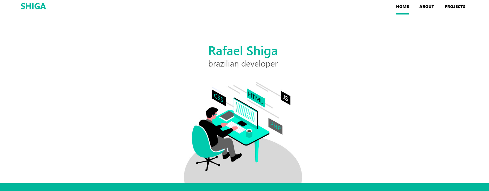

<h1 align="center">
  :rocket:
   
   
  Shiga Projects v1
</h1>

<h3 align="center">
<strong>Version 1: Showcase of my projects. <a href="https://rafashiga.github.io/shiga-projects-v1/">site</a></strong>
</h3>

  
  
  
  
   
   
  <a href="#space_invader-technologies">Technologies</a>
   
   
  
   
   

## :space_invader: Technologies

- HTML
- Javascript
- CSS
- [Bulma](https://bulma.io/)
- [Animate css](https://daneden.github.io/animate.css/)
